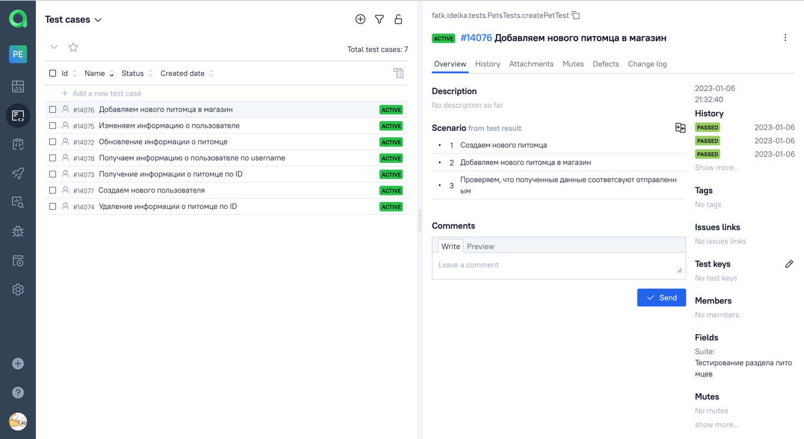
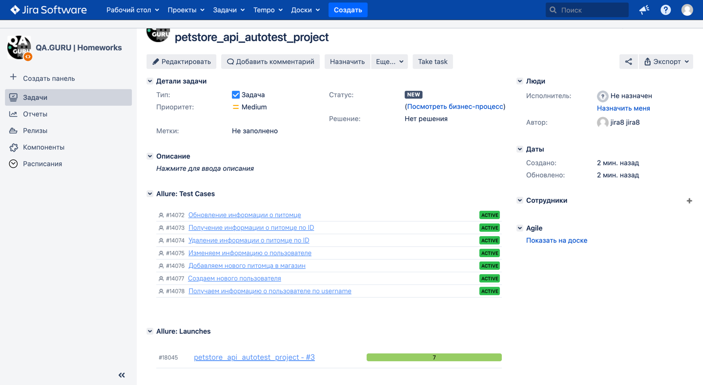

<a id="lift"></a>

# Проект по автоматизации тестирования API [PetStore](https://petstore.swagger.io/)

## Содержание :clipboard:

* <a href="#description">Описание проекта и особенности</a>
* <a href="#stack">Cтек технологий</a>
* <a href="#objects">Реализованные проверки</a>
* <a href="#gradle">Запуск тестов</a>
    + <a href="#gradle">Gradle</a>
    + <a href="#jenkins">Jenkins</a>
* <a href="#allure">Отчет о результатах тестирования</a>
    + <a href="#allure">Allure Report</a>
    + <a href="#alluretestops">Интеграция с Allure TestOps</a>
* <a href="#jira">Интеграция с Jira</a>
* <a href="#telegram">Уведомления в Telegram</a>

# <a id="description">Описание</a>
Проект включает в себя API-тесты.\
Некоторые факты о проекте:

- [x] На проекте используется модель `Lombok`
- [x] Генерация данных с помощью библиотеки `Faker`
- [x] Интегрирован `Allure TestOps`
- [x] Интегрирован `Jira`
- [x] Реализованы спецификации для запросов и ответов
- [x] Реализована отправка уведомлений в `Telegram`

# <a id="stack">Технологии и инструменты</a>

<p  align="center">
  <code></code>
  <code></code>
  <code></code>
  <code></code>
  <code></code>
  <code></code>
  <code></code>
  <code></code>
  <code></code>
  <code></code>
  <code></code>
  <code></code>
</p>

>* Автотесты написаны на `Java` с использованием библиотеки `RestAssured`
>* Десериализация с помощью библиотеки `Jackson`
>* Фреймворк для модульного тестирования `JUnit`
>* Для автоматизации сборки проекта исопльзуется `Gradle`
>* Сборка проекта в CI/CD `Jenkins`
>* Формирование отчета в `Allure Report`
>* Отчеты отправляются в `Telegram`

# <a id="objects">Реализованные проверки</a>

1. [ ] _Добавление нового питомца в магазин_
2. [ ] _Получение информации о питомце по ID_
3. [ ] _Обновление информации о питомце_
4. [ ] _Удаление информации о питомце по ID_
5. [ ] _Добавление нового пользователя_
6. [ ] _Получение информации о пользователе по username_
7. [ ] _Изменение информации о пользователе_

# <a id="gradle">Запуск тестов из терминала</a>

```bash
gradle clean test
```

# <a id="jenkins">Запуск тестов в Jenkins</a>

Параметры запуска:
<p align="center">
  
</p>

После завершения сборки результаты тестов доступны в:
> `Allure Report` \
> `Allure TestOps` - результаты подгружаются автоматически и также обновляются при изменении кода

<p align="center">
  
</p>

# <a id="allure">Отчет о результатах тестирования в Allure Report</a>

Главная страница `Allure Report` включает в себя:
> `ALLURE REPORT` - дата и время проведения тестов,а также диаграмма с указанием процента и количества успешных,
> упавших и сломавшихся в процессе выполнения тестов \
> `TREND` - тенденция выполнения для всех запусков \
> `SUITES` - отображение тестов по тестовым наборам \
> `CATEGORIES` - отображение тестов по категориям

<p align="center">
  
</p>

На странице `Suites` можно посмотреть информацию о тестах:

<p align="center">
  
</p>

Также там доступны `логи` запросов и ответов, отфильтрованные в удобочитаемый вариант:

<p align="center">
  
</p>

# <a id="alluretestops">Интеграция с Allure TestOps</a>

Инфографику по проведенным тестам можно посмотреть в разделе `Dashboards`

<p align="center">
  
</p>

В разделе `Launches` находится история запусков тестов

<p align="center">
  
</p>

Кликнув на проект, попадаем в `Детали проекта`
> Внутри доступны следующие вкладки:
> * `Overview` - общая информация по тестам
> * `Tree` - информация по каждому тесту
> * `Errors` - логи ошибок
> * `Graphs` - графическое представление времени проведения тестов
> * `Timeline` - показан таймлайн всех тестов

<p align="center">
  
</p>

В разделе `Testcases` автоматически подгружаются тест-кейсы

<p align="center">
  
</p>

> Можно добавлять ручные тест-кейсы \
> Доступен экспорт тест-кейсов в _PDF_, _CSV_ \
> Есть возможность выборочно запускать тесты, создавать тест-планы и т.д.

<p align="center">
  
</p>

# <a id="jira">Интеграция с Jira</a>

<p align="center">
  
</p>

# <a id="telegram">Уведомления в Telegram</a>
> После завершения сборки, бот автоматически отправляет уведомление в телеграм с результатами теста
<p align="center">
  
</p>

[Вернуться наверх ⬆](#lift)